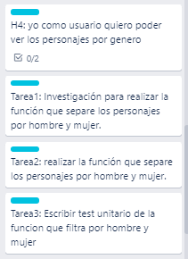
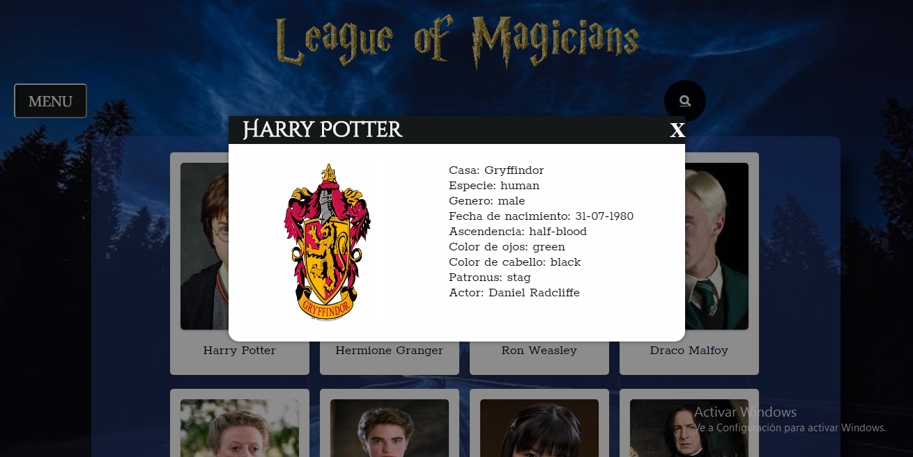

# Data Lovers

## Índice

* [1. Preámbulo](#1-preámbulo)
* [2. Objetivos de aprendizaje](#2-objetivos-de-aprendizaje)
* [3. Criterios de aceptación mínimos del proyecto](#3-criterios-de-aceptación-mínimos-del-proyecto)

***

## 1. Preámbulo

En este proyecto se construyó una página web que permite a los usuarios ver a sus personajes favoritos, ordenarlos y agruparlos de diferentes maneras. 

## 2. Objetivos de aprendizaje

El objetivo principal de este proyecto es que, entendiendo las necesidades de
tus usuarios, aprendas a diseñar y construir una interfaz web donde se pueda
visualizar y manipular data.

Revisa la lista y reflexiona sobre los objetivos que conseguiste en el
proyecto anterior. Piensa en eso al decidir tu estrategia de trabajo individual
y de equipo.

### UX

- [x] Diseñar la aplicación pensando y entendiendo al usuario.
- [x] Crear prototipos para obtener _feedback_ e iterar.
- [x] Aplicar los principios de diseño visual (contraste, alineación, jerarquía).
- [x] Planear y ejecutar _tests_ de usabilidad.

### HTML y CSS

- [x] Entender y reconocer por qué es importante el HTML semántico.
- [x] Identificar y entender tipos de selectores en CSS.
- [ ] Entender como funciona `flexbox` en CSS.
- [x] Construir tu aplicación respetando el diseño planeado (maquetación).

### DOM

- [x] Entender y reconocer los selectores del DOM (querySelector | querySelectorAll).
- [x] Manejar eventos del DOM. (addEventListener)
- [x] Manipular dinámicamente el DOM. (createElement, appendchild, innerHTML, value)

### Javascript

- [x] Manipular arrays (`filter` | `map` | `sort` | `reduce`).
- [ ] Manipular objects (key | value).
- [x] Entender el uso de condicionales (`if-else` | `switch`).
- [x] Entender el uso de bucles (`for` | `forEach`).
- [ ] Entender la diferencia entre expression y statements.
- [ ] Utilizar funciones (parámetros | argumentos | valor de retorno).
- [ ] Entender la diferencia entre tipos de datos atómicos y estructurados.
- [x] Utilizar ES Modules (`import` | `export`).

### Pruebas Unitarias (_testing_)
- [x] Testear funciones (funciones puras).

### Git y GitHub
- [x] Ejecutar comandos de git (`add` | `commit` | `pull` | `status` | `push`).
- [x] Utilizar los repositorios de GitHub (`clone` | `fork` | gh-pages).
- [x] Colaborar en Github (pull requests).

### Buenas prácticas de desarrollo
- [x] Organizar y dividir el código en módulos (Modularización).
- [x] Utilizar identificadores descriptivos (Nomenclatura | Semántica).
- [x] Utilizar linter para seguir buenas prácticas (ESLINT).

## 3. Criterios de aceptación mínimos del proyecto

### Historias de usuario

Para realizar las historias de usuario se utilizó la herramienta [Trello]( www.trello.com/trello‎), que es una gran ayuda al momento de organizar las historias y agregarles subtareas.

Se trabajaron 7 historias:

Cada historia tenía subtareas:

### Diseño de la Interfaz de Usuario

#### Prototipo de baja fidelidad

Primer maquetado por historias a lápiz y papel.

Historia 1: Yo como usuario quiero ver a los personajes.

Historia 2: Yo como usuario quiero poder ver las caracteristicas de cada personaje.

Historia 3-historia 6 : Yo como usuario quiero poder ver a los personajes agrupados por orden alfabetico, por genero, por roles y por casas.

Historia 7: Yo como usuario quiero poder buscar rapidamente a los personajes.

#### Prototipo de alta fidelidad

Se utilizo [Figma](https://www.figma.com/) que es una herramienta online de prototipado. 

### Implementación de la Interfaz de Usuario (HTML/CSS/JS)

